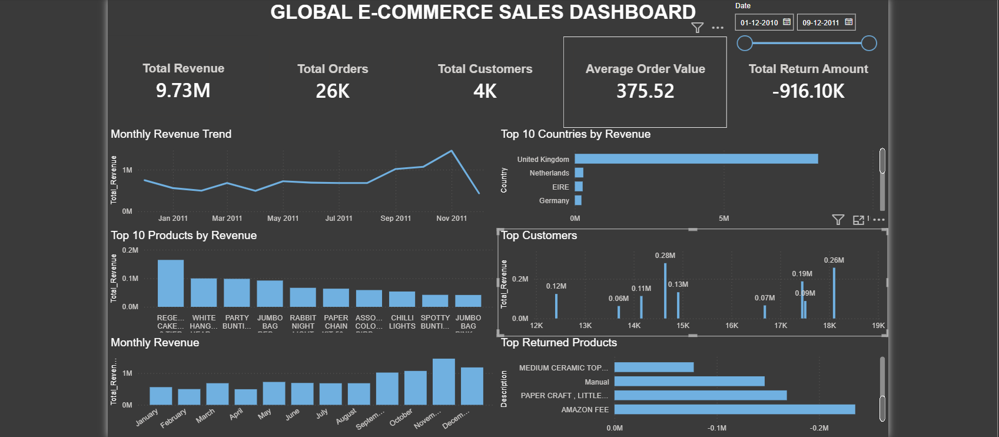

# 📊 Global E-Commerce Sales Analysis


## 📌 Project Overview

This project analyzes over **536,000+ global retail transactions** to uncover business insights related to sales performance, customer behavior, product performance, returns, and geographic revenue distribution.

The analysis was performed using **Microsoft Excel**, **Microsoft SQL Server**, and **Power BI**, following a complete end-to-end data analytics workflow.

---

# 🎯 Business Objective

The objective of this project is to help business stakeholders answer questions such as:

- How much revenue did the company generate?
- Which countries contribute the highest revenue?
- Who are the top customers?
- Which products generate the highest sales?
- What are the monthly sales trends?
- Which products have the highest returns?
- What business recommendations can improve profitability?

---

# 🛠 Tools & Technologies

| Tool | Purpose |
|------|---------|
| Microsoft Excel | Data Cleaning & Initial Analysis |
| SQL Server | Data Storage & Business Queries |
| Power BI | Interactive Dashboard |
| GitHub | Project Documentation & Version Control |

---

# 📂 Dataset Information

**Dataset Name**

Online Retail Dataset

**Source**

UCI Machine Learning Repository

**Dataset Size**

- 541,909 Original Records
- 536,641 Cleaned Records
- 8 Original Columns
- 1 Calculated Column (Sales_Amount)

---

# 🧹 Data Cleaning Process

The following data cleaning steps were performed in Microsoft Excel:

- Removed duplicate records
- Handled missing values
- Investigated missing Customer IDs
- Investigated blank product descriptions
- Identified returned orders
- Created Sales_Amount column
- Verified data types
- Performed data quality checks

---

# 🗄 SQL Analysis

Business questions answered using SQL Server include:

- Total Revenue
- Total Orders
- Total Customers
- Average Order Value
- Revenue by Country
- Top 10 Countries
- Top Products by Revenue
- Top Customers
- Monthly Revenue Trend
- Returned Orders
- Total Return Amount
- Revenue by Month

---

# 📈 Power BI Dashboard

## Dashboard Preview


---

# 📊 Dashboard Features

### KPI Cards

- Total Revenue
- Total Orders
- Total Customers
- Average Order Value
- Total Return Amount

### Visualizations

- Monthly Revenue Trend
- Revenue by Month
- Top 10 Countries by Revenue
- Top 10 Products by Revenue
- Top Customers
- Top Returned Products

### Filters

- Date Range Slicer

---

# 📌 Key Insights

### 💰 Revenue

- Total Revenue exceeded **9.7 Million**.

### 🌍 Country Performance

- United Kingdom generated the highest revenue.
- Netherlands and Germany were among the top international markets.

### 👤 Customer Analysis

- Approximately **4,000 unique customers** placed orders.
- A small group of customers generated a significant share of total revenue.

### 📦 Product Performance

- White Hanging Heart T-Light Holder was among the highest revenue-generating products.
- Several products consistently appeared in the top-selling list.

### 📅 Sales Trend

- Revenue peaked during **November**, indicating strong seasonal demand before Christmas.

### 🔄 Returns Analysis

- Returned orders represented a significant negative sales value.
- Manual adjustments, Amazon fees, and certain products contributed heavily to return amounts.

---

# 💡 Business Recommendations

- Increase inventory before the holiday season.
- Expand marketing efforts in high-performing countries.
- Introduce loyalty programs for top customers.
- Investigate high-return products to reduce losses.
- Improve customer registration to reduce missing Customer IDs.
- Review products with zero selling price.

---

# 📁 Repository Structure

```
Global-Ecommerce-Sales-Analysis
│
├── Dataset
│
├── Excel
│
├── SQL QUERIES
│
├── POWER BI DASHBOARD
│
├── Images
│
├── README.md
│
└── Reports
```

---

# 🚀 Skills Demonstrated

- Data Cleaning
- Data Validation
- Exploratory Data Analysis
- SQL Query Writing
- Aggregate Functions
- GROUP BY
- HAVING
- CASE Statements
- Business Analysis
- Dashboard Design
- Data Visualization
- KPI Development
- GitHub Documentation

---

# 📷 Dashboard Screenshot



---

# 👨‍💻 Author

**Rohit Gurjar**

Aspiring Data Analyst

### Connect with Me

- LinkedIn: *www.linkedin.com/in/rohit-gurjar-data*
- GitHub: *https://github.com/rohitgurjar-data*

---

## ⭐ If you found this project useful, consider giving it a Star!
